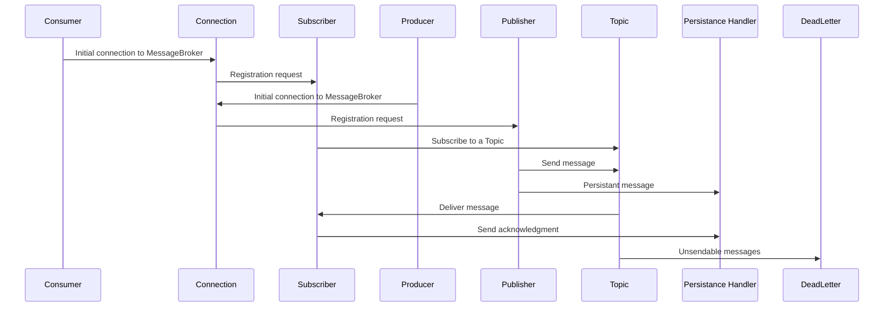
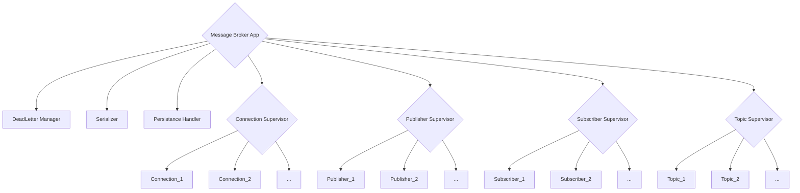

Message Broker Application: Manages the overall message broker system, including supervision and starting other modules.

Connection: Handles TCP/UDP connections from clients (producers and consumers).

Publisher: Manages the registration and message publishing for producers.

Subscriber: Manages the registration, subscription, and message delivery for consumers.

Topic: Represents a topic that messages can be published to and consumed from.

DeadLetter: Handles messages that are deemed "unsendable" and stores them in a dead letter channel.

Serializer: Serializes and deserializes messages for network communication.

Persistence: Handles persistent messages, subscriber acknowledgments, and durable queues.

---

---

